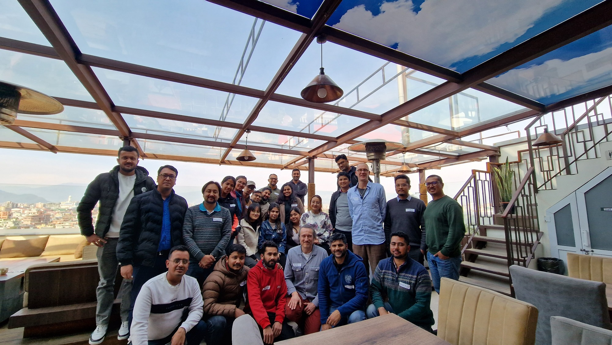

**Climate Data Collection and Analysis, Kathmandu, Feb 26-27 2024**

*Workshop organized and led by Dr Taylor Smith (University of Potsdam, Germany), Dr Bodo Bookhagen (University of Potsdam, Germany) and Dr Shakil Regmi (South-Eastern Finland University of Applied Sciences, Finland)*

**YouTube recordings are available [here](https://www.youtube.com/playlist?list=PLf4x2rqfvPEPDQ--Cozr9OMLE71Hb9cD5)**

*Workshop Goals:* The workshop aims to present open-source data processing methods for working with time series and satellite data, with a particular focus on snow, water, and rainfall. The participants will gain hands-on experience with open-source data processing tools, data visualization, and the design of open-source hardware.

This github page contains all workshop materials. Talks and recording links will be uploaded after the workshop.

*Workshop Schedule*

Day 1: Satellite Data Processing with Open-Source Tools
 - overview of satellite climate Data with focus on hydrologic and sediment flux data
 - introduction to Google Earth Engine and extracting relevant data for study sites
 - integrating watershed data and mapping climate trends
 - creating visualizations and consistent reports

Day 2: Designing, Building, and Analyzing Data from Open-Source Sensors
 - measuring high-fequency hydro-climatic data
 - designing and building a low-cost river monitoring station 
 - collecting, transmitting, and prcessing high-frequency data
 - combining sensor and satellite data for further analysis 
 - research outlook and practical applications in Nepal
